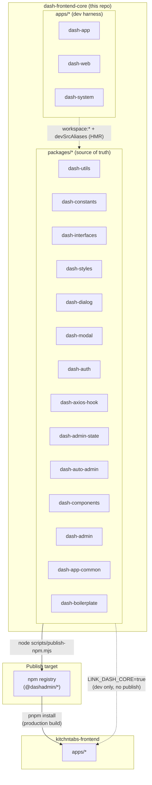
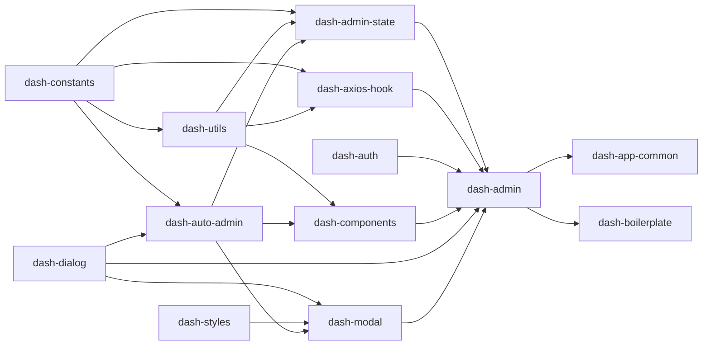
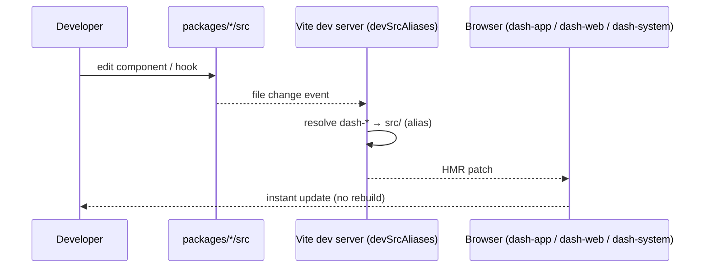
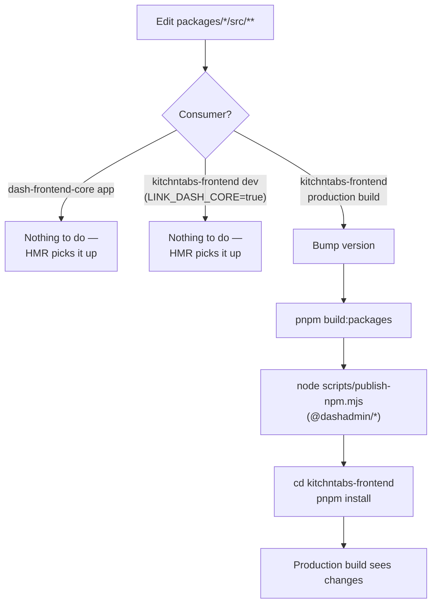
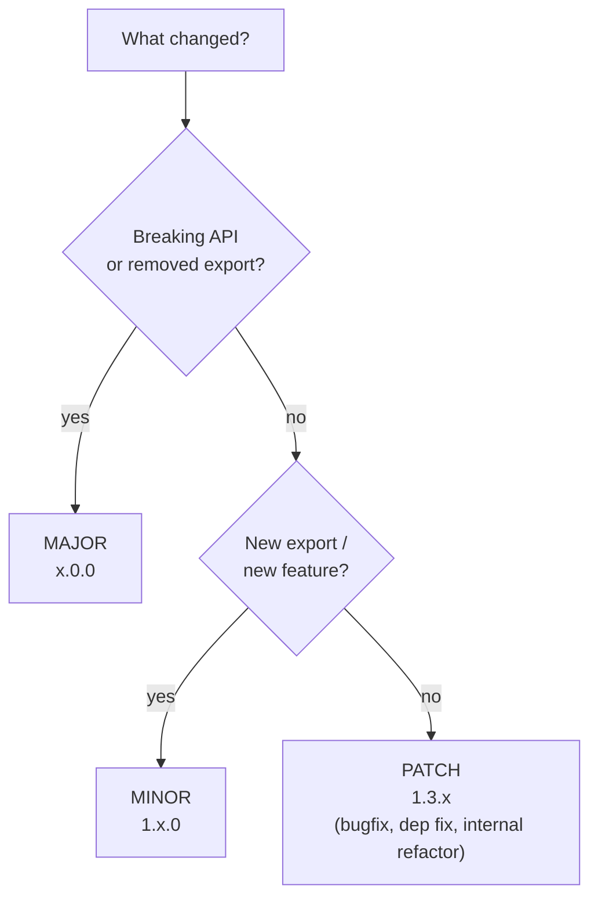
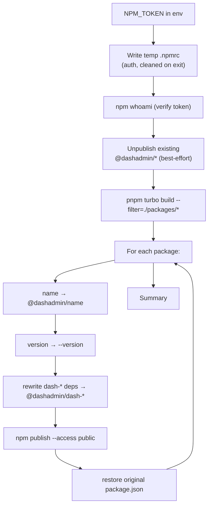

# Dash Frontend Core — Development & Publishing Guide

This monorepo hosts the **`@dashadmin`** package family: the reusable building blocks
(`dash-admin`, `dash-components`, `dash-auto-admin`, …) that power Dash-based admin
applications such as **KitchnTabs**.

It is consumed two different ways, and understanding that split is the key to the whole
workflow:

| Consumer | How it consumes `dash-*` | Registry |
| --- | --- | --- |
| **`dash-frontend-core` apps** (`apps/dash-app`, `dash-web`, `dash-system`) | Directly from **workspace source** (`src/`) — instant HMR | none (workspace) |
| **`kitchntabs-frontend` — local dev** | Directly from **sibling-repo source**, opt-in via `LINK_DASH_CORE=true` (see `vite-plugins/dashCoreSrcAliases.mts`) — instant HMR, no publish needed | none (source alias) |
| **`kitchntabs-frontend` — production build** | From **published packages** | npm (`@dashadmin/*`) only |

> **Golden rule:** inside this repo you edit *source*. `LINK_DASH_CORE=true` lets
> `kitchntabs-frontend`'s **dev** server see that source live, same as this repo's own
> apps. Its **production** build never aliases source — it always installs whatever was
> last published to npm. A source change only reaches a production build **after you
> republish and re-install**.
>
> Verdaccio (a local unscoped registry) was used here previously and is now
> **deprecated** — removed in favor of `LINK_DASH_CORE` for local dev and the real npm
> registry for everything published. If you see `localhost:4873` or `pnpm publish:local`
> referenced anywhere, it's stale.

---

## 1. Repository topology



### Internal dependency layers



Foundation packages (`dash-constants`, `dash-utils`, `dash-interfaces`, `dash-styles`)
have **no internal deps** and change the most rarely. `dash-admin` sits on top and
re-exports the assembled application.

---

## 2. Development workflow (editing source)

Inside `dash-frontend-core`, apps resolve every `dash-*` import to its **`src/`
directory** via the `devSrcAliases` mechanism in each app's `vite.config.mts`. This means:

- ✅ Edit any file under `packages/<pkg>/src/**` → the running dev app hot-reloads
  instantly. **No build, no publish, no version bump.**
- The alias regex `^pkgname(?:/src)?(/.*)?$` maps both `dash-x/foo` and
  `dash-x/src/foo` onto the real source, so deep imports work.



### Start a dev app

```bash
# from repo root
pnpm dev:web:dash-system:development   # dash-system app
pnpm dev:web:dash-web:development       # dash-web app
pnpm dev:web:dash-app:development       # dash-app app
```

### When do I need to build?

You only build packages when producing **published artifacts** (`dist/`) — i.e. right
before publishing to npm. Day-to-day source editing never needs it, including when
developing against `kitchntabs-frontend` with `LINK_DASH_CORE=true` — that mode aliases
straight to `src/`, same as this repo's own apps.

```bash
pnpm build:packages            # build every packages/* (dist/)
pnpm --filter dash-admin run build   # build a single package
```

> ⚠️ **Two-instance context bug reminder.** Never let a built file in `dist/` import
> back into `../src/` (a wrong relative path that escapes `dist/`). It loads a *second*
> copy of a React context (e.g. `DashThemeContext`) and you get
> `useDashThemeContext must be used within a DashThemeProvider`. Keep `dist` imports
> inside `dist`.

---

## 3. Source modifications → propagating to consumers



The essential rule: **a change is invisible to a `kitchntabs-frontend` production build
until you (1) bump, (2) build, (3) publish to npm, and (4) re-install in the consumer.**
Local dev (`LINK_DASH_CORE=true`) skips all four steps — it's reading this repo's `src/`
directly.

---

## 4. Version bump policy

All `dash-*` packages are published under a **single, aligned version** (the publish
scripts default to one flat version). Follow **semver against consumer impact**:



| Change type | Bump | Example |
| --- | --- | --- |
| Bugfix, dependency cleanup, internal refactor | **patch** | the `react-beautiful-dnd → @hello-pangea/dnd` peer cleanup |
| New component / hook / prop (backwards-compatible) | **minor** | added a new `DashAuto*` view |
| Removed/renamed export, changed prop contract | **major** | renamed `DASHAdmin` prop |

> Removing a **required peer dependency** (as we did with `react-beautiful-dnd`) only
> *relaxes* the consumer's constraints, so it is **non-breaking → patch**.

Set the version at publish time:

```bash
NPM_TOKEN=*** node scripts/publish-npm.mjs --version 1.3.27
# or omit --version to auto-bump the current patch (see script header)
```

---

## 5. Publishing to **npm** (`@dashadmin` scope)

This is the **only** publish target — there is no local/QA registry. Every
`kitchntabs-frontend` production build installs straight from npm, so a change isn't
"released" until it lands here. (A local Verdaccio registry filled this role previously;
it's deprecated — local QA now happens via `LINK_DASH_CORE=true`, §2 above, which needs
no publish step at all.)

`scripts/publish-npm.mjs` transforms each unscoped `dash-*` package into
`@dashadmin/dash-*` on the fly, rewrites internal cross-deps to the scoped name, bumps
the version, publishes, and restores the original `package.json`.



Run it:

```bash
# dry run first — prints what would publish, no writes to npm
NPM_TOKEN=*** node scripts/publish-npm.mjs --version 1.3.27 --dry-run

# real publish
NPM_TOKEN=*** node scripts/publish-npm.mjs --version 1.3.27
```

> 🔒 **Token hygiene.** The token lives only in the `NPM_TOKEN` env var and a temp
> `.npmrc` that is deleted on exit — never commit it. **Rotate immediately any token that
> has been pasted into chat, logs, or shell history.**

Consume in the app:

```bash
cd ../kitchntabs-frontend
pnpm install          # pulls @dashadmin/* from npm
```

---

## 6. Worked example — the `react-beautiful-dnd` → `@hello-pangea/dnd` migration

This is the exact change that motivated this guide, end to end.

**Problem.** `pnpm install` in `kitchntabs-frontend` failed with
`Conflicting peer dependencies: react-beautiful-dnd`. Five published packages
(`dash-components`, `dash-dialog`, `dash-info`, `dash-auto-admin`, `dash-modal`) declared
a stale `"react-beautiful-dnd": "latest"` **peer dependency** — a now-deprecated library
that could not be satisfied. The actual source code had already moved to
`@hello-pangea/dnd`.

**Fix applied to source (this repo):**

1. Removed the `react-beautiful-dnd` peer from all 5 `packages/*/package.json`.
2. `dash-components` already bundles `@hello-pangea/dnd@^18.0.1` in `dependencies`
   (self-contained `SortableDataGrid`) — nothing else needed.
3. Aligned `react-18-beautiful-dnd-grid` to `@hello-pangea/dnd@^18.0.1`.
4. Relaxed the `react-custom-scrollbars-2` peer from `"latest"` → `"^4.5.0"` to clear
   the related unmet-peer warnings.

No component code changed — `@hello-pangea/dnd` is an API-compatible drop-in.

**Because this only *removes* a required peer, it is non-breaking → PATCH bump.**

**QA, then release:**

```bash
# 1. QA against the consumer with LINK_DASH_CORE=true — no build/publish needed,
#    Vite aliases straight to this repo's src/
cd ../kitchntabs-frontend && LINK_DASH_CORE=true pnpm dev   # conflict gone

# 2. Release to npm at the next patch
cd ../dash-frontend-core
NPM_TOKEN=*** node scripts/publish-npm.mjs --version 1.3.27

# 3. Pick it up in a production build
cd ../kitchntabs-frontend && pnpm install
```

---

## 7. Command quick-reference

| Task | Command |
| --- | --- |
| Run a dev app (source HMR) | `pnpm dev:web:dash-system:development` |
| Build all packages | `pnpm build:packages` |
| Build one package | `pnpm --filter dash-admin run build` |
| QA against `kitchntabs-frontend` (source alias, no publish) | `cd ../kitchntabs-frontend && LINK_DASH_CORE=true pnpm dev` |
| Publish → npm (scoped) | `NPM_TOKEN=*** node scripts/publish-npm.mjs --version X.Y.Z` |
| npm dry-run | `NPM_TOKEN=*** node scripts/publish-npm.mjs --version X.Y.Z --dry-run` |
| Re-install in consumer (production build) | `cd ../kitchntabs-frontend && pnpm install` |

---

_Each package also carries its own `README.md` describing its role. See the
[`@dashadmin` org on npm](https://www.npmjs.com/org/dashadmin)._
