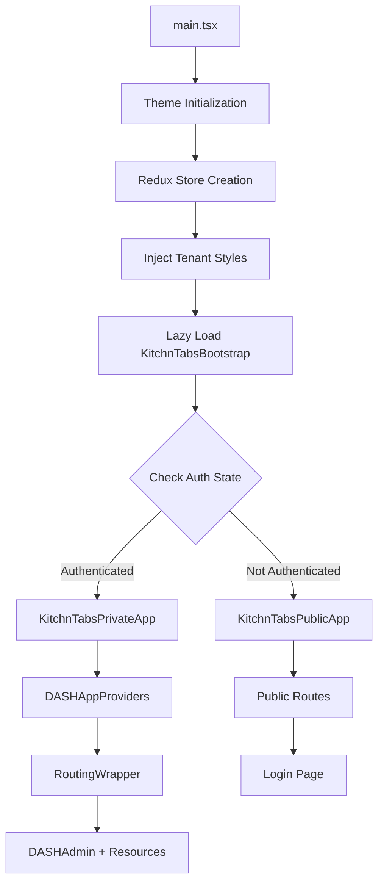
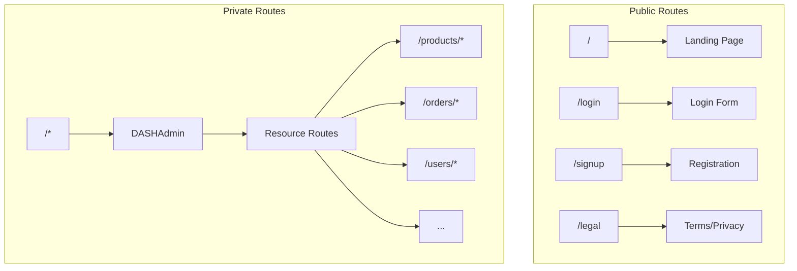
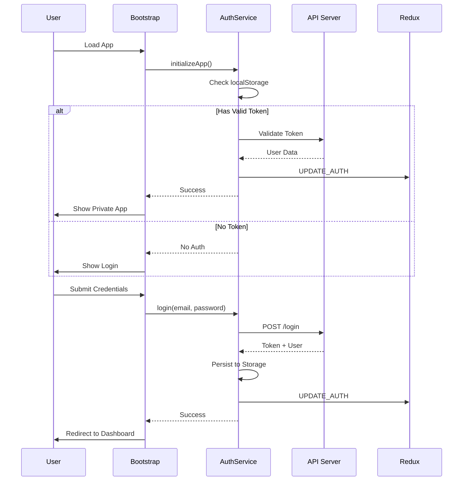

# KitchnTabs Application Architecture

> **Version**: 1.0.0  
> **Last Updated**: December 2025

This document provides a comprehensive overview of the KitchnTabs application architecture, including its structure, key components, data flow, and design patterns.

---

## Table of Contents

1. [Overview](#overview)
2. [Technology Stack](#technology-stack)
3. [Monorepo Structure](#monorepo-structure)
4. [Application Entry Flow](#application-entry-flow)
5. [Package Architecture](#package-architecture)
6. [State Management](#state-management)
7. [Routing Architecture](#routing-architecture)
8. [Authentication Flow](#authentication-flow)
9. [Data Layer](#data-layer)
10. [Resource System](#resource-system)
11. [Multi-Platform Support](#multi-platform-support)
12. [Styling Architecture](#styling-architecture)
13. [Build Configuration](#build-configuration)
14. [Key Design Patterns](#key-design-patterns)

---

## Overview

KitchnTabs is a **multi-tenant, multi-platform** e-commerce and point-of-sale application built as part of the DASH Platform ecosystem. It serves as an admin panel and storefront management system with support for:

- 📱 **Mobile** (Android/iOS via Capacitor)
- 🖥️ **Desktop** (Windows/macOS/Linux via Electron)
- 🌐 **Web** (Browser-based SPA)

The application follows a **modular monorepo architecture** using PNPM workspaces, enabling code sharing across multiple applications while maintaining separation of concerns.

---

## Technology Stack

| Category | Technology |
|----------|------------|
| **Runtime** | React 18+ with TypeScript |
| **Build Tool** | Vite 5+ |
| **Package Manager** | PNPM with workspaces |
| **State Management** | Redux Toolkit + React Redux |
| **Data Fetching** | TanStack React Query + Axios |
| **Admin Framework** | react-admin 5.x |
| **UI Components** | Material UI (MUI) 7.x |
| **Routing** | React Router 7.x |
| **i18n** | ra-i18n-polyglot |
| **Real-time** | Laravel Echo + Pusher |
| **Mobile** | Capacitor |
| **Desktop** | Electron |
| **Styling** | Less + CSS Variables |

---

## Monorepo Structure

```
dash-frontend/
├── apps/
│   └── kitchntabs/           # Main application
│       ├── src/
│       │   ├── main.tsx              # Entry point
│       │   ├── KitchnTabsBootstrap.tsx
│       │   ├── KitchnTabsResources.tsx
│       │   ├── KitchnTabsRoutes.tsx
│       │   ├── core/                 # Public/Private app shells
│       │   ├── components/           # App-specific components
│       │   ├── contexts/             # App contexts
│       │   ├── dash-extensions/      # Local overrides for dash-* packages
│       │   ├── i18n/                 # Translations
│       │   ├── styles/               # App styles
│       │   └── assets/               # Static assets
│       ├── package.json
│       └── vite.config.mts
│
├── packages/
│   ├── dash-admin/           # Core admin framework
│   ├── dash-admin-state/     # Redux state management
│   ├── dash-auth/            # Authentication utilities
│   ├── dash-components/      # Shared UI components
│   ├── dash-utils/           # Utility functions
│   ├── dash-constants/       # System constants
│   ├── dash-interfaces/      # TypeScript interfaces
│   ├── dash-styles/          # Shared styles/themes
│   ├── kt-ecommerce/         # E-commerce domain logic
│   ├── kt-tabs/              # Tabs/orders domain
│   ├── kt-mall/              # Mall/marketplace domain
│   ├── kt-kiosk/             # Kiosk mode
│   ├── kt-cashcount/         # Cash counting features
│   └── kt-pages/             # Shared pages
│
├── package.json              # Root workspace config
├── pnpm-workspace.yaml       # Workspace definition
└── turbo.json                # Turborepo config
```

### Package Naming Convention

| Prefix | Purpose |
|--------|---------|
| `dash-*` | Platform-agnostic shared packages (admin, auth, components, utils) |
| `kt-*` | KitchnTabs domain-specific packages (ecommerce, tabs, mall, kiosk) |

---

## Application Entry Flow

The application bootstraps through a carefully orchestrated initialization sequence:



### Key Bootstrap Components

1. **`main.tsx`** - Entry point that:
   - Initializes theme from localStorage
   - Creates Redux store with initial state
   - Syncs with Electron store if available
   - Renders the root component tree

2. **`KitchnTabsBootstrap.tsx`** - Authentication orchestrator that:
   - Checks persisted auth data
   - Attempts auto-login via `DASHAuthenticationService`
   - Restores Redux state from localStorage
   - Renders appropriate app shell (Public/Private)

3. **`KitchnTabsPrivateApp.tsx`** - Authenticated app shell that:
   - Sets up React Query client
   - Configures i18n provider
   - Initializes data/auth providers
   - Loads admin resources dynamically
   - Wraps content in `DASHAdmin`

---

## Package Architecture

### Core Packages (`dash-*`)

#### `dash-admin`
The core admin framework built on react-admin with custom extensions:

```
dash-admin/src/
├── DASHAdmin.tsx          # Main admin component
├── AppWrapper.tsx         # Global wrapper with error boundaries
├── RoutingWrapper.tsx     # Routing configuration
├── components/            # UI components (loader, navigation, etc.)
├── contexts/              # Auth, Echo, Query contexts
├── hooks/                 # Custom hooks
├── layout/                # Layout components
├── providers/             # i18n, theme providers
├── resources/             # Resource loader utilities
├── templates/             # CRUD templates
├── default-theme/         # Theme configuration
└── systemResources.tsx    # Core system resources
```

**Key Exports:**
- `DASHAdmin` - Main admin wrapper component
- `ResourceTemplate` - Base CRUD resource template
- `DASHAuthenticationService` - Auth service class
- `RoutingWrapper` - Router configuration component
- Theme utilities and language packs

#### `dash-admin-state`
Redux state management with typed actions and reducers:

```
dash-admin-state/src/
├── redux/
│   ├── store.ts           # Store configuration
│   ├── reducers/          # Individual reducers
│   │   ├── Auth.ts
│   │   ├── Common.ts
│   │   ├── Settings.ts
│   │   └── ...
│   └── actions/           # Action creators
├── defaults/              # Default state values
└── hooks/                 # Redux hooks
```

**State Slices:**
- `auth` - User authentication state
- `common` - App-wide state (nav, dimensions, branding)
- `settings` - Theme, locale, layout preferences
- `page` - Current page metadata
- `resources` - Loaded resource configurations
- `formData` - Form state management

#### `dash-auth`
Authentication utilities and persistence:

- `AuthPersistenceService` - Token/user persistence
- Device store sync for Electron/Capacitor
- Session management utilities

#### `dash-components`
Reusable UI components:

- Form inputs (JSON editors, color pickers)
- Display components (loaders, cards)
- Layout components (panels, grids)
- Navigation components (breadcrumbs)

#### `dash-utils`
Utility functions and hooks:

- `dashStorage` - Unified storage abstraction
- `updateDomCssVariables` - Theme variable injection
- `platformDetection` - Platform-specific utilities
- Various helper hooks

### Domain Packages (`kt-*`)

#### `kt-ecommerce`
E-commerce domain logic with 240+ components:

```
kt-ecommerce/src/
├── components/           # E-commerce UI components
│   ├── Product/         # Product management
│   ├── Order/           # Order management
│   ├── Category/        # Category trees
│   ├── Marketplace/     # Marketplace integration
│   └── ...
├── resources/           # react-admin resources
├── schemas/             # Data schemas
├── filters/             # List filters
└── interfaces/          # TypeScript types
```

**Resources:** Products, Categories, Orders, Brands, Currencies, Pricelists, Modifiers, Campaigns, Marketplaces, etc.

#### `kt-tabs`
Restaurant/POS tabs management:

```
kt-tabs/src/
├── components/          # Tabs UI components
├── resources/           # Tab resources
└── schemas/             # Tab data schemas
```

#### `kt-mall`
Multi-tenant mall/marketplace features:

```
kt-mall/src/
├── components/          # Mall UI components
├── resources/           # Mall resources
└── ...
```

#### `kt-kiosk`
Self-service kiosk mode:

- Kiosk display components
- Kiosk-specific resources

#### `kt-cashcount`
Cash counting and reconciliation:

- Cash count forms
- Reporting components

---

## State Management

The application uses **Redux Toolkit** for global state management with the following architecture:

```mermaid
flowchart LR
    subgraph Redux Store
        A[auth]
        B[common]
        C[settings]
        D[page]
        E[resources]
        F[formData]
        G[componentData]
    end
    
    H["Components"] -->|dispatch| Redux Store
    Redux Store -->|useSelector| H
    I["Persistence Layer"] <-->|sync| Redux Store
```

### Initial State Configuration

```typescript
const INITIAL_APP_STATE: IDASHAppState = {
    settings: {
        navStyle: 'FIXED',
        layoutType: 'FRAMED',
        themeType: 'DARK',
        locale: 'es',
        // ...
    },
    common: {
        appPath: '/',
        navExpanded: true,
        navSize: 'small',
        panelSettings: { appName, logos, ... },
        // ...
    },
    auth: {
        authenticated: false,
        user: null,
        auth: null,
    },
    // ...
};
```

### State Persistence

Auth state is persisted to localStorage and synchronized:

1. On login: State saved via `AuthPersistenceService`
2. On boot: State restored via `KitchnTabsBootstrap`
3. Electron: Additional sync via `electronStore`

---

## Routing Architecture

The app uses **React Router 7** with conditional router selection based on platform:

```typescript
// Desktop/Electron: HashRouter for file:// protocol
// Web/Mobile: BrowserRouter for standard URLs

const RouterComponent = envVars.IS_ELECTRON 
    ? HashRouter 
    : BrowserRouter;
```

### Route Structure



### Route Files

- **`KitchnTabsRoutes.tsx`** - Shared and public route definitions
- **`DASHPrivateSharedRoutes.tsx`** - Authenticated shared routes
- Resource routes generated dynamically by react-admin

---

## Authentication Flow



### Key Auth Components

- **`DASHAuthenticationService`** - Centralized auth logic
- **`DASHAuthProvider`** - react-admin auth provider
- **`AuthPersistenceService`** - Token/session storage
- **`AuthContext`** - React context for auth state

---

## Data Layer

### Data Provider Architecture

The app uses a custom **`DASHDataProvider`** that wraps react-admin's data provider interface:

```typescript
// Simplified data provider structure
const DASHDataProvider = {
    getList: (resource, params) => axios.get(...),
    getOne: (resource, params) => axios.get(...),
    create: (resource, params) => axios.post(...),
    update: (resource, params) => axios.put(...),
    delete: (resource, params) => axios.delete(...),
    // ... other CRUD operations
};
```

### API Integration

- **Base URL**: Configured via environment variables (`VITE_API_URL`)
- **Authentication**: Bearer token in headers
- **Request/Response**: Axios interceptors for auth handling

### React Query Integration

```typescript
const queryClient = new QueryClient({
    defaultOptions: {
        queries: {
            refetchOnWindowFocus: false,
            staleTime: 5 * 60 * 1000,  // 5 minutes
            retry: 1,
        },
    },
});
```

---

## Resource System

### Resource Manifest

Resources are defined in `KitchnTabsResources.tsx` as a lazy-loaded manifest:

```typescript
export const KitchnTabsResources: ResourceManifest = {
    // System resources
    systemResources: () => import('dash-admin/src/systemResources'),
    
    // Domain resources
    productResource: () => import('kt-ecommerce/src/resources/productResource'),
    orderResource: () => import('kt-ecommerce/src/resources/orderResource'),
    tabResources: () => import('kt-tabs/src/resources/tabResource'),
    // ...
};
```

### Resource Configuration

Each resource follows the `IDashAutoAdminResourceConfig` interface:

```typescript
interface IDashAutoAdminResourceConfig {
    name: string;
    icon?: ReactNode;
    group?: string;
    list?: ComponentType;
    create?: ComponentType;
    edit?: ComponentType;
    show?: ComponentType;
    options?: object;
}
```

### Resource Categories

| Category | Package | Resources |
|----------|---------|-----------|
| **System** | `dash-admin` | Users, Roles, Permissions, Settings |
| **Catalog** | `kt-ecommerce` | Products, Categories, Brands, Modifiers |
| **Commerce** | `kt-ecommerce` | Orders, Campaigns, Pricelists |
| **Operations** | `kt-tabs` | Tabs, Tables |
| **Mall** | `kt-mall` | Tenants, Storefronts |
| **Hardware** | `kt-kiosk` | Kiosks, Displays |
| **Finance** | `kt-cashcount` | Cash Counts, Reports |

---

## Multi-Platform Support

### Platform Detection

The Vite config includes comprehensive platform detection:

```typescript
const detectPlatform = (buildConfig) => ({
    isAndroid: capacitorPlatform === 'android',
    isIOS: capacitorPlatform === 'ios',
    isCapacitorBuild: targetType === 'mobile',
    isElectronBuild: platform === 'electron',
    targetType: 'browser' | 'mobile' | 'desktop',
});
```

### Environment Variables

Platform-specific variables injected at build time:

```typescript
VITE_IS_ELECTRON: boolean
VITE_IS_ANDROID: boolean
VITE_IS_IOS: boolean
VITE_IS_CAPACITOR: boolean
VITE_IS_MOBILE: boolean
VITE_PLATFORM_TYPE: 'web' | 'desktop' | 'mobile'
```

### Platform-Specific Behavior

```typescript
// Router selection
const Router = IS_ELECTRON ? HashRouter : BrowserRouter;

// Storage abstraction
const storage = IS_ELECTRON 
    ? window.electronStore 
    : localStorage;

// Navigation
const basePath = IS_CAPACITOR ? './' : '/';
```

---

## Styling Architecture

### CSS Variables System

Theming is implemented via CSS custom properties:

```css
:root[data-theme="dark"] {
    --body-bg: #121212;
    --text-color: #ffffff;
    --primary-color: var(--tenant-primary, #1976d2);
    /* ... */
}

:root[data-theme="light"] {
    --body-bg: #ffffff;
    --text-color: #121212;
    /* ... */
}
```

### Less Preprocessing

```less
// dash-variables.less - Global variables
@import "../../../packages/dash-styles/src/dash-variables.less";
@import '@app/dash-variables.less';  // App-specific overrides
@import "../../../packages/dash-styles/src/dash-css-transformer.less";
```

### Tenant Customization

Colors and branding can be customized per-tenant:

```typescript
const updateDomCssVariables = (theme, colors) => {
    document.documentElement.style.setProperty(
        '--primary-color', 
        colors.primary
    );
    // ...
};
```

---

## Build Configuration

### Vite Configuration Highlights

```typescript
// vite.config.mts
export default ({ mode }) => {
    const buildConfig = loadBuildConfig();  // From build_config.json
    
    return defineConfig({
        base: isCapacitorBuild || isElectronBuild ? './' : '/',
        
        build: {
            rollupOptions: {
                output: {
                    manualChunks: getManualChunks(), // Code splitting
                },
                external: externalModules,  // Platform-specific externals
            },
        },
        
        optimizeDeps: {
            include: [/* Pre-bundled deps */],
            exclude: ['dash-admin', 'dash-auto-admin', ...],
        },
    });
};
```

### Code Splitting Strategy

Vendor chunks are split for optimal caching:

| Chunk | Contents |
|-------|----------|
| `vendor-react` | React, ReactDOM, Scheduler |
| `vendor-mui` | MUI, Emotion, Popper |
| `vendor-react-admin` | react-admin, ra-* packages |
| `vendor-react-router` | React Router |
| `vendor-utils` | Lodash, Axios, qs |
| `vendor-dayjs` | Day.js |
| `vendor-heavy` | Framer Motion, DnD |

---

## Key Design Patterns

### 1. Lazy Loading with Suspense

```tsx
const KitchnTabsPrivateApp = lazy(() => import('./core/KitchnTabsPrivateApp'));

<Suspense fallback={<GlobalSmallLoader />}>
    <KitchnTabsPrivateApp />
</Suspense>
```

### 2. Resource Manifest Pattern

Dynamic resource loading through import functions:

```typescript
const manifest: ResourceManifest = {
    productResource: () => import('kt-ecommerce/src/resources/productResource'),
};

const { resources, loading } = useDashResourceManifest(manifest);
```

### 3. Provider Composition

Nested providers for context isolation:

```tsx
<Provider store={store}>
    <AppWrapper>
        <DASHAppProviders>
            <RoutingWrapper>
                <DASHAdmin />
            </RoutingWrapper>
        </DASHAppProviders>
    </AppWrapper>
</Provider>
```

### 4. Platform Abstraction

```typescript
// Unified storage abstraction
const dashStorage = {
    getItem: (key) => IS_ELECTRON 
        ? electronStore.get(key) 
        : localStorage.getItem(key),
    setItem: (key, value) => { /* ... */ },
};
```

### 5. Extension Pattern

Local `dash-extensions` folder allows app-specific overrides:

```
src/dash-extensions/
├── config/            # Custom auth/data providers
├── components/        # Extended components
├── managers/          # Custom managers
└── utils/             # App-specific utilities
```

---

## Appendix: File Reference

### Entry Points

| File | Purpose |
|------|---------|
| `src/main.tsx` | Application entry point |
| `src/KitchnTabsBootstrap.tsx` | Auth state orchestration |
| `src/KitchnTabsResources.tsx` | Resource manifest |
| `src/KitchnTabsRoutes.tsx` | Route definitions |

### Core App Shells

| File | Purpose |
|------|---------|
| `src/core/KitchnTabsPrivateApp.tsx` | Authenticated app shell |
| `src/core/KitchnTabsPublicApp.tsx` | Public/login app shell |

### Configuration

| File | Purpose |
|------|---------|
| `vite.config.mts` | Vite build configuration |
| `package.json` | Dependencies and scripts |
| `tsconfig.json` | TypeScript configuration |
| `.env.development` | Development environment |
| `.env.production` | Production environment |

---

> This documentation reflects the architecture as of the current codebase state. For implementation details of specific packages, refer to the individual package documentation.
