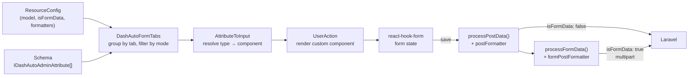

# DashAutoForm Architecture

How a DashAdmin form actually works, end to end: **Resource → Schema →
DashAutoForm → react-hook-form → dataProvider → Laravel**.

Read this before building any non-trivial form, and *definitely* before
debugging a 422 that "should be impossible".

- [1. The pipeline](#1-the-pipeline)
- [2. Resource & Schema](#2-resource--schema)
- [3. DashAutoForm — schema to inputs](#3-dashautoform--schema-to-inputs)
- [4. Custom components — two mechanisms](#4-custom-components--two-mechanisms)
- [5. react-hook-form & react-admin](#5-react-hook-form--react-admin)
- [6. Submit: JSON vs FormData](#6-submit-json-vs-formdata)
- [7. Processors](#7-processors)
- [8. Formatter hooks](#8-formatter-hooks)
- [9. Backend-config-driven forms](#9-backend-config-driven-forms)
- [10. Debugging](#10-debugging)

---

## 1. The pipeline



Two independent axes decide what happens to a field:

1. **How it renders** — `type` / `component` (§3, §4).
2. **How it serialises** — `processor` + `isFormData` (§6, §7).

Confusing the two causes most form bugs. A field can render perfectly and still
serialise into something the backend rejects.

---

## 2. Resource & Schema

A **ResourceConfig** describes an endpoint + its behaviour. A **Schema** is an
array of `IDashAutoAdminAttribute` describing its fields.

```tsx
const myResource: IDashAutoAdminResourceConfig = {
    model: 'lab/project',            // API path
    schema: myProjectSchema,
    component: ResourceTemplate,
    formGroupMode: 'tabs',           // 'tabs' | 'groups'
    isFormData: true,                // ← §6, changes serialisation entirely
    mutationMode: 'pessimistic',
    postFormatter: (data) => data,          // §8
    formPostFormatter: (params, form) => form,
    contextComponent: ({ mode, children }) => children,   // §9
};
```

Key attribute fields (full list in `IDashAutoAdminAttribute.ts`):

| Field | Purpose |
|---|---|
| `attribute` | Model key. **Dot paths (`settings.foo`) mean nesting** — see §6. |
| `type` | Drives rendering: `String`/`Number`/`Boolean`/`Date`, a `'resource/path.field'` string, or `'custom'`. |
| `component` | A component **reference** or a **registry string** — two different mechanisms (§4). |
| `custom: true` | Legacy flag paired with `component`. |
| `tab` | Groups fields into tabs. |
| `inList` / `inEdit` / `inCreate` / `inShow` / `inDrawer` | Per-mode visibility. |
| `processor` | Serialisation override (§7). |
| `fieldProps` / `componentProps` | Props to the input / to a custom component. |
| `listAttribute` | Alternate key for read/display (e.g. `character_icon` writes, `character_icon_url` reads). |

---

## 3. DashAutoForm — schema to inputs

`DashAutoFormTabs` groups the schema by `tab`, filters by mode
(`create`/`edit`/`view`/`list`), and renders each surviving attribute through
`AttributeToInput`.

Two behaviours worth knowing:

- **A tab whose fields are all filtered out for the current mode disappears.** A
  field that's `inEdit: false` everywhere makes its tab vanish in edit — which
  reads as "my tab is broken".
- **A single remaining tab group renders without the tab wrapper.** Tabs only
  appear once there are ≥2 groups.

`AttributeToInput` then dispatches on `type`:

| `type` | Renders |
|---|---|
| `String` / `Number` / `Boolean` / `Date` | The matching react-admin input |
| `'resource/path.field'` | A reference/autocomplete input against that endpoint |
| `'custom'` / anything unmatched | Falls through to the custom-component path (§4) |

---

## 4. Custom components — two mechanisms

**These are different and are easy to conflate.**

### 4a. Direct import (frontend-authored schema)

```tsx
import MyField from '../components/MyField';

{ attribute: 'foo', type: String, custom: true, component: MyField }
```

`AttributeToInput` passes a non-string `component` straight through to
`UserAction`, which renders it with:

```tsx
<Action attribute={...} method={mode} resourceConfig={...} record={record} {...attribute.componentProps} />
```

> `UserAction` passes `record` as an **explicit prop**. Prefer it and only fall
> back to `useRecordContext()`:
> ```tsx
> const project = (record as any) ?? useRecordContext();
> ```

### 4b. Registry string (backend-driven schema)

A backend config can only send **JSON**, so it names a component as a string:

```php
'type' => 'custom', 'component' => 'JsonColorSelector',
```

`AttributeToInput` resolves it via `useComponentRegistry()`:

```tsx
const component = components[type];
if (component) return { custom: true, type: 'component', component };
return { custom: true, type: 'component', component: () => <>No component for {type}</> };
```

The registry is populated once at app bootstrap (e.g.
`loadAutoAdminComponents()` in the app's private-app entry).

> **Rendering literally `No component for X` means the registry key doesn't match
> the backend string.** Check spelling on both sides first — it fails soft, with
> no console error.

### Custom field contract

```tsx
const MyField = ({ method, attribute, resourceConfig, record }: IDashAutoAdminCustomFieldComponent) => {
    const { setValue } = useFormContext();
    // read:  record?.[attribute.attribute]
    // write: setValue(attribute.attribute, v, { shouldDirty: true })
};
```

Custom fields are **not** a `value`/`onChange` pair — they read the record and
write through react-hook-form (§5).

---

## 5. react-hook-form & react-admin

DashAdmin sits on react-admin, which uses react-hook-form for form state.

- **Read** the persisted record via `useRecordContext()` (or the `record` prop).
- **Write** via `useFormContext().setValue(name, value, { shouldDirty: true })`.
- `shouldDirty: true` matters — without it the Save button may stay disabled
  (unless the resource sets `saveButtonAlwaysEnabled: true`).
- **Nothing is sent until Save.** With `mutationMode: 'pessimistic'` the record
  only changes after the server confirms. A custom field mutating in-memory state
  has changed *nothing* server-side yet.
- **Dot-path `attribute` values nest.** `settings.foo` produces
  `{ settings: { foo } }` in the submitted payload — which is the root of §6.

---

## 6. Submit: JSON vs FormData

`isFormData` on the ResourceConfig switches the entire serialisation path.

### `isFormData: false` (default) — plain JSON

`processPostData()` applies a few processors (§7) and `postFormatter`, then posts
JSON. Nested objects survive naturally. **No file uploads.**

### `isFormData: true` — multipart

Required for file uploads. `processFormData()` walks the payload:

| Value | Becomes |
|---|---|
| `[]` (empty array) | `key[] = ''` |
| Array | one `key[]` per element |
| **Object** (not File/rawFile) | `key[objKey]` per key — **one level only**, then `return`s |
| File / `rawFile` | the file (via a `processor`) |
| Everything else | falls through to the processor stage, then `String(value)` |

### ⚠️ The two FormData traps

**Trap 1 — nesting is one level deep.**

```js
Object.keys(value).forEach((objKey) => {
    form.append(key + '[' + objKey + ']', value[objKey]);
});
return;
```

`settings.foo` → `settings[foo]` → Laravel parses it back into a real array. ✅
`settings.kiosk.foo` → the inner object stringifies as `"[object Object]"`. ❌

> **Keep dot-path attributes exactly one level deep** under `isFormData: true`.

**Trap 2 — that branch `return`s BEFORE the processor stage.**

So **`processor` never applies to a nested sub-key.** `processor: 'Boolean'`
fixes a *top-level* `is_active`; on `settings.is_active` it is silently a no-op.

**Trap 3 — FormData has no types.** Every value becomes a string. A JS `false`
arrives as `"false"`, which Laravel's `boolean` rule **rejects** (it accepts
`true/false/1/0/"1"/"0"`). Symptom: *"must be true or false"* on a toggle that
looks fine.

Fixes, in order of preference:

1. **Top-level field** → `processor: 'Boolean'` (sends `"1"`/`"0"`).
2. **Nested sub-key** → normalise server-side in `prepareForValidation()`:
   ```php
   $v = filter_var($v, FILTER_VALIDATE_BOOLEAN, FILTER_NULL_ON_FAILURE);
   ```
3. Last resort → `formPostFormatter` (§8).

### ⚠️ JSON columns replace unless you merge

A form usually submits only the keys of the tab that was edited. If the model
casts that column to `array` with no merging mutator, saving one tab **wipes
every other writer's keys**.

Either merge in the controller:

```php
$validated['settings'] = array_merge((array) ($existing->settings ?? []), $incoming);
```

…or add a merging mutator on the model (`App\Models\Tenant` does this).

**Consequence either way:** a key absent from the payload is left untouched, so a
setting **cannot be deleted by omission** — write an explicit `null`.

---

## 7. Processors

`processor` overrides how **one** field serialises. Set it on the schema
attribute.

| Processor | Effect | Use for |
|---|---|---|
| `File` | `value.rawFile ?? value` | `ImageInput`/`FileInput` fields |
| `RawFile` | `value.rawFile` | when the raw file is guaranteed |
| `Blob` | appended as a Blob | binary payloads |
| `Boolean` | `"1"` / `"0"` | **any boolean under `isFormData: true`** |
| `BooleanOnOff` | `"on"` / `"off"` | APIs expecting on/off |
| `BooleanActiveInactive` | `"active"` / `"inactive"` | APIs expecting status words |
| `Stringify` | `JSON.stringify(value)` | a genuinely nested object the backend `json_decode`s |
| `Null` | `''` when null | APIs distinguishing null from absent |

Scope: `Boolean`, `BooleanOnOff`, `BooleanActiveInactive` apply in **both**
`processPostData` (JSON) and `processFormData`. The file/blob ones are
FormData-only. **None apply to nested sub-keys** (§6, Trap 2).

`processFormData` matches a field by the **first dot segment**:

```js
resourceConfig.schema.find((field) => field.attribute.split(".")[0] === key)
```

So `settings.a` and `settings.b` both resolve to whichever `settings.*` entry
appears first — another reason processors on nested keys are unreliable.

---

## 8. Formatter hooks

Escape hatches on the ResourceConfig, in execution order:

| Hook | Signature | Runs | Use for |
|---|---|---|---|
| `postFormatter` | `(data, method) => data` | both paths, before serialisation | reshaping payloads (flatten relations, drop computed fields) |
| `formPostFormatter` | `(params, form) => form` | **FormData only**, last | anything `processFormData` can't express |

`formPostFormatter` receives the already-built `FormData` and may rewrite it
wholesale. `productResource.tsx` is the canonical example: it clears the form and
rebuilds it to emit `prices[0][price]`-style indexed arrays.

> `postFormatter` has already run by the time `formPostFormatter` receives
> `params` — don't apply it twice.

---

## 9. Backend-config-driven forms

To let a backend config define fields with **no frontend change** (tenant
settings, Lab project kiosk settings), you need four pieces:

1. **Backend config** returning `setting_formats` entries (`id`, `attribute`,
   `label`, `type`, `rules`, `options`, `default_value`).
2. **An endpoint** serving it, e.g. `GET .../settings/formats`.
3. **A cache provider** on the resource, so the form has the schema:
   ```tsx
   contextComponent: ({ mode, children }) =>
       mode === 'list' ? children : (
           <SystemRequestsCache cacheKey="my_formats" apiUrl="my/formats" cacheSeconds={300}>
               {children}
           </SystemRequestsCache>
       ),
   ```
4. **A bridge component** on a `custom` attribute that reads the cache and calls
   `DashAutoFormTabs` with the fetched schema:
   ```tsx
   const { formats, loading } = useSystemRequestsCache();
   // map entries → schema, then:
   DashAutoFormTabs({ schema, resourceConfig: null, options: { mode: method, label } });
   ```

> **Look values up by `id`, not `attribute`.** `attribute` is the dot *path*
> (`settings.foo`); the JSON column is keyed by the bare `id` (`foo`). Indexing
> with the dotted path yields `undefined`, every field falls back to its default,
> and previously saved values are quietly discarded on next save.

**Derive backend validation from the same config** rather than restating it —
validation fails closed, so drift shows up as a field that renders fine and 422s.

Worked example: `vanexa-backend-domain/docs/LAB-PROJECT-SETTINGS.md`.

---

## 10. Debugging

| Symptom | Likely cause |
|---|---|
| `No component for X` | Registry key ≠ backend `component` string (§4b) |
| 422 "must be true or false" | FormData stringified a boolean (§6, Trap 3) |
| Field value saved as `[object Object]` | Dot path nested >1 level (§6, Trap 1) |
| `processor` ignored | It's on a nested sub-key (§6, Trap 2) |
| Other keys vanish after save | JSON column replaced, not merged (§6) |
| Can't clear a setting | Merge semantics — write explicit `null` (§6) |
| Saved values don't prefill | Looked up by `attribute` instead of `id` (§9) |
| Tab missing | All its fields filtered out for this mode (§3) |
| Backend config change invisible | `config:cache`/`route:cache` (run `config:clear`), or the 300s IndexedDB schema cache |
| Save button disabled | `setValue` without `shouldDirty: true` (§5) |

**Inspect the wire.** Most of these are one DevTools look away — open Network →
the failing request → **Payload**. Under `isFormData: true` you'll see the actual
`settings[foo]` keys and whether a value went out as `"false"` or `"0"`.
