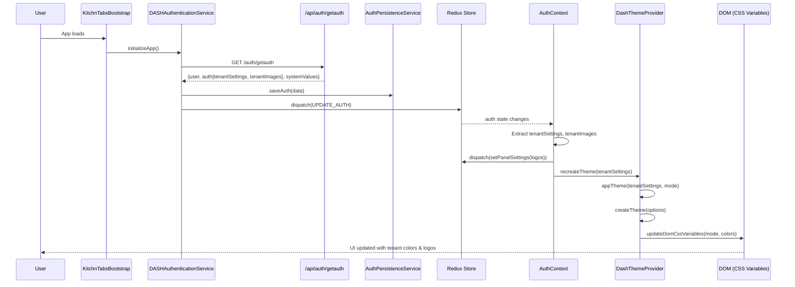

# Tenant Theme Flow Documentation

## Overview

This document describes the complete flow of how the KitchnTabs application retrieves tenant settings (theme colors and logos) from the backend API and applies them to the UI dynamically.

---

## 1. Authentication & Data Retrieval

### 1.1 Initial Bootstrap

**File:** [`KitchnTabsBootstrap.tsx`](file:///Users/farandal/DASH-PW-PROJECT/dash-frontend/apps/kitchntabs/src/KitchnTabsBootstrap.tsx)

The bootstrap component initiates the authentication flow:

```typescript
// Line 217: Initialize app
const initResult = await DASHAuthenticationService.initializeApp(true);
```

### 1.2 Authentication Service

**File:** `dash-admin/src/contexts/auth/DASHAuthenticationService.tsx`

The authentication service calls the `/api/auth/getauth` endpoint to retrieve complete authentication data:

```typescript
const { data: authResponse } = await axios.get(getEnv('APP_GETAUTH_ENDPOINT'));
// Default endpoint: '/api/auth/getauth'
```

### 1.3 API Response Structure

The `/api/auth/getauth` endpoint returns:

```json
{
  "user": {
    "id": "...",
    "name": "...",
    "email": "...",
    // ... other user fields
  },
  "auth": {
    "tenantSettings": {
      "colors": {
        "bodybg-primary--light": "#ffffffff",
        "bodybg-secondary--light": "#ecececff",
        "primary-color--light": "#34831b",
        // ... hundreds of color variables for light and dark modes
      },
      "primary_language_code": "es",
      "primary_currency": { /* ... */ },
      "alarm_settings": { /* ... */ }
    },
    "tenantImages": {
      "banner": {
        "original": "http://example.com/banner.png"
      },
      "horizontal_logo": {
        "original": "http://example.com/logo-h.png"
      },
      "squared_logo": {
        "original": "http://example.com/logo-sq.png"
      }
    },
    "tenant": {
      "id": "...",
      "name": "...",
      "slug": "..."
    }
  },
  "systemValues": {
    "point_of_sales": [ /* ... */ ],
    "managed_mall": { /* ... */ },
    "user_notifications": [ /* ... */ ],
    "preference_formats": [ /* ... */ ]
  }
}
```

---

## 2. Data Persistence

### 2.1 Local Storage Persistence

**File:** `dash-auth/src/AuthPersistenceService.tsx`

The authentication service persists data to localStorage:

```typescript
AuthPersistenceService.saveAuth({
  auth: authResponse.auth,
  systemValues: authResponse.systemValues
});
```

**Storage Keys:**
- `authenticated`: Boolean flag
- `user`: User object
- `token`: JWT token
- `tenantSettings`: Tenant settings object
- `tenantImages`: Tenant images object
- `systemValues`: System configuration

### 2.2 Redux State

**File:** `dash-admin-state/src/redux/reducers/Auth.ts`

The auth data is also dispatched to Redux:

```typescript
dispatch(
  DASH_REDUX_ACTIONS.updateAuth(ACTION_UPDATE_AUTH, {
    user: authResponse.user,
    authenticated: true,
    auth: authResponse.auth,
  })
);
```

---

## 3. Theme Application

### 3.1 AuthContext Integration

**File:** [`dash-admin/src/contexts/auth/AuthContext.tsx`](file:///Users/farandal/DASH-PW-PROJECT/dash-frontend/packages/dash-admin/src/contexts/auth/AuthContext.tsx#L407-L492)

The `AuthContext` monitors Redux `auth` state changes and triggers theme updates:

```typescript
// Lines 418-462: Monitor auth state
React.useEffect(() => {
  if (auth.authenticated) {
    let tenantSettings = auth?.auth?.tenantSettings;
    let tenantImages = auth?.auth?.tenantImages;
    
    // Fallback to persisted data if not in Redux
    if (!tenantSettings) {
      tenantSettings = AuthPersistenceService.getTenantSettings();
    }
    
    if (!tenantImages) {
      tenantImages = AuthPersistenceService.getTenantImages();
    }
    
    // Update panel settings with logos
    const tenantImagesKey = JSON.stringify(tenantImages);
    if (tenantImages && lastTenantImagesRef.current !== tenantImagesKey) {
      const logos = {
        ...(tenantImages.horizontal_logo.original && { horizontalLogo: tenantImages.horizontal_logo.original }),
        ...(tenantImages.squared_logo.original && { squaredLogo: tenantImages.squared_logo.original }),
        ...(tenantImages.banner.original && { loginBackground: tenantImages.banner.original })
      };
      
      dispatch(DASH_REDUX_ACTIONS.setPanelSettings(logos));
    }
    
    // Recreate theme with tenant colors
    const tenantSettingsKey = JSON.stringify(tenantSettings);
    if (tenantSettings && lastTenantSettingsRef.current !== tenantSettingsKey) {
      recreateTheme(tenantSettings);
      
      // Sync to Redux settings slice
      dispatch(DASH_REDUX_ACTIONS.updateThemeSettings(tenantSettings));
    }
  }
}, [auth.authenticated, contextValues.systemValues]);
```

### 3.2 DashThemeProvider

**File:** [`dash-admin/src/default-theme/DashThemeContext.tsx`](file:///Users/farandal/DASH-PW-PROJECT/dash-frontend/packages/dash-admin/src/default-theme/DashThemeContext.tsx)

The `DashThemeProvider` is responsible for creating and updating the MUI theme:

```typescript
// Line 56-80: Recreate theme function
const recreateTheme = (tenantSettings?: any, mode?: string) => {
  const settings = tenantSettings || getTenantSettings();
  const themeMode = mode || document.documentElement.getAttribute('data-theme') || 'dark';
  
  console.log('Recreating MUI theme with tenant settings:', settings, 'mode:', themeMode);

  // Create new theme options with tenant colors
  const newThemeOptions = appTheme(
    extendedOptions,
    {
      tenantSettings: settings,
      colors: settings?.colors,
      currentMode: themeMode,
    }
  );
  
  const newTheme = createTheme(newThemeOptions);
  
  setThemeOptions(newThemeOptions);
  setTheme(newTheme);
  
  // Apply CSS variables to DOM
  updateDomCssVariables(themeMode, settings?.colors, settings?.values);
};
```

### 3.3 CSS Variable Injection

**File:** `dash-utils/src/updateDomCssVariables.ts`

The `updateDomCssVariables` function applies tenant colors as CSS custom properties:

```typescript
export function updateDomCssVariables(
  mode: string, 
  colors: Record<string, string>, 
  values?: Record<string, string>
) {
  const root = document.documentElement;
  
  // Apply color variables based on mode
  Object.entries(colors).forEach(([key, value]) => {
    if (key.endsWith(`--${mode}`)) {
      const cssVarName = key.replace(`--${mode}`, '');
      root.style.setProperty(`--${cssVarName}`, value);
    }
  });
  
  // Apply other values
  if (values) {
    Object.entries(values).forEach(([key, value]) => {
      root.style.setProperty(`--${key}`, value);
    });
  }
}
```

**Result:** CSS variables like `--primary-color`, `--bodybg-primary`, etc. are set on `:root`

---

## 4. Component Hierarchy

```
KitchnTabsBootstrap
  └─> DASHAuthenticationService.initializeApp()
      └─> GET /api/auth/getauth
          └─> AuthPersistenceService.saveAuth()
          └─> Redux dispatch (UPDATE_AUTH)
              └─> KitchnTabsPrivateApp
                  └─> DASHAppProviders
                      └─> I18nBridgeProvider
                      └─> DashThemeProvider ← Creates MUI theme with tenant colors
                          └─> AuthContextProvider ← Monitors auth changes
                              └─> useEffect → recreateTheme()
                                  └─> updateDomCssVariables()
                              └─> Redux dispatch (setPanelSettings) ← Sets tenant logos
```

---

## 5. Logo Application

### 5.1 Panel Settings Redux

**Action:** `DASH_REDUX_ACTIONS.setPanelSettings(logos)`

The logos are stored in the Redux `settings.panelSettings` slice:

```typescript
{
  horizontalLogo: "http://example.com/logo-h.png",
  squaredLogo: "http://example.com/logo-sq.png",
  loginBackground: "http://example.com/banner.png"
}
```

### 5.2 Logo Consumption

Components that need logos access them via Redux selector:

```typescript
const panelSettings = useSelector((state: any) => state.settings.panelSettings);

// Use logos


```

**Common locations:**
- Sidebar header
- Login page
- App header
- Loading screens

---

## 6. Theme Mode Toggle

### 6.1 Dark/Light Mode Switch

**File:** [`DashThemeContext.tsx`](file:///Users/farandal/DASH-PW-PROJECT/dash-frontend/packages/dash-admin/src/default-theme/DashThemeContext.tsx#L82-L116)

The theme provider observes the `data-theme` attribute on `<html>`:

```typescript
// Lines 83-109: MutationObserver for theme mode changes
useEffect(() => {
  const observer = new MutationObserver((mutations) => {
    mutations.forEach((mutation) => {
      if (mutation.type === 'attributes' && mutation.attributeName === 'data-theme') {
        const newMode = document.documentElement.getAttribute('data-theme') || 'dark';
        if (newMode !== currentMode) {
          console.log('Theme mode changed from', currentMode, 'to', newMode);
          setCurrentMode(newMode);
          const settings = getTenantSettings();
          
          // Update CSS variables for new mode
          updateDomCssVariables(newMode, settings?.colors, settings?.values);
        }
      }
    });
  });

  observer.observe(document.documentElement, {
    attributes: true,
    attributeFilter: ['data-theme']
  });

  return () => observer.disconnect();
}, [currentMode]);
```

### 6.2 Mode Selection

When the user toggles dark/light mode:

1. Component sets `document.documentElement.setAttribute('data-theme', 'light' | 'dark')`
2. `MutationObserver` detects the change
3. `updateDomCssVariables` re-applies colors for the new mode
4. Theme is recreated with new mode

---

## 7. Color System

### 7.1 Color Naming Convention

Colors follow a pattern: `{name}--{mode}`

Examples:
- `primary-color--light`: Primary color in light mode
- `primary-color--dark`: Primary color in dark mode
- `bodybg-primary--light`: Body background (primary) in light mode
- `bodybg-primary--dark`: Body background (primary) in dark mode

### 7.2 CSS Custom Properties

After processing, CSS variables are available globally:

```css
:root {
  --primary-color: #34831b;     /* Applied based on current mode */
  --bodybg-primary: #ffffffff;
  --text-color: #000000;
  /* ... hundreds more */
}
```

Components can use these variables:

```css
.my-component {
  background-color: var(--bodybg-primary);
  color: var(--text-color);
}
```

---

## 8. Re-initialization & Updates

### 8.1 On App Load

1. `KitchnTabsBootstrap` calls `DASHAuthenticationService.initializeApp()`
2. If token exists, calls `/api/auth/getauth`
3. Stores data to localStorage + Redux
4. `AuthContext` detects auth state change
5. Calls `recreateTheme()` and dispatches `setPanelSettings()`

### 8.2 On Manual Refresh

**Custom Event:** `DASHTRefreshTheme`

```typescript
// Trigger theme refresh
window.dispatchEvent(new Event('DASHTRefreshTheme'));
```

The `DashThemeProvider` listens for this event:

```typescript
// Lines 129-138: Listen for refresh event
useEffect(() => {
  const handler = (event: Event) => {
    if (event.type === 'DASHTRefreshTheme') {
      const tenantSettings = getTenantSettings();
      recreateTheme(tenantSettings, currentMode);
    }
  };
  window.addEventListener('DASHTRefreshTheme', handler);
  return () => window.removeEventListener('DASHTRefreshTheme', handler);
}, []);
```

---

## 9. Flow Diagram



---

## 10. Key Files Reference

| File | Purpose |
|------|---------|
| [`KitchnTabsBootstrap.tsx`](file:///Users/farandal/DASH-PW-PROJECT/dash-frontend/apps/kitchntabs/src/KitchnTabsBootstrap.tsx) | App entry point, initiates auth |
| `DASHAuthenticationService.tsx` | Manages authentication, calls `/api/auth/getauth` |
| `AuthPersistenceService.tsx` | Persists auth data to localStorage |
| [`AuthContext.tsx`](file:///Users/farandal/DASH-PW-PROJECT/dash-frontend/packages/dash-admin/src/contexts/auth/AuthContext.tsx) | Monitors auth changes, triggers theme updates |
| [`DashThemeContext.tsx`](file:///Users/farandal/DASH-PW-PROJECT/dash-frontend/packages/dash-admin/src/default-theme/DashThemeContext.tsx) | Creates MUI theme, applies tenant colors |
| [`DASHAppProviders.tsx`](file:///Users/farandal/DASH-PW-PROJECT/dash-frontend/packages/dash-admin/src/default-theme/DASHAppProviders.tsx) | Wraps app with theme provider |
| `updateDomCssVariables.ts` | Applies tenant colors as CSS variables |
| `appTheme.ts` (dash-styles) | Generates MUI theme options from tenant settings |

---

## 11. Troubleshooting

### Colors not applying?

1. Check if `tenantSettings.colors` exists in localStorage (`tenantSettings` key)
2. Verify `/api/auth/getauth` returns color data
3. Check browser console for "Recreating MUI theme" logs
4. Inspect `:root` element CSS variables in DevTools

### Logos not showing?

1. Check Redux state: `state.settings.panelSettings`
2. Verify `tenantImages` exists in localStorage
3. Check network tab for image load errors
4. Ensure URLs are accessible (not blocked by CORS/authentication)

### Theme not switching light/dark?

1. Check `data-theme` attribute on `<html>` element
2. Verify `MutationObserver` is running (check console logs)
3. Ensure both `--light` and `--dark` color variants exist in `tenantSettings.colors`

---

## 12. Summary

The tenant theme flow is a multi-step process:

1. **Fetch:** Authentication retrieves tenant settings from `/api/auth/getauth`
2. **Persist:** Data is saved to localStorage and Redux
3. **Monitor:** `AuthContext` watches for auth state changes
4. **Apply:** `DashThemeProvider` creates MUI theme and applies CSS variables
5. **Render:** Components use CSS variables and Redux panel settings for styling

This architecture allows tenants to have fully customized branding with colors and logos that persist across sessions and update reactively when changed.
